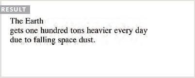
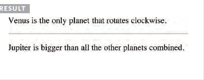
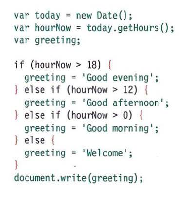
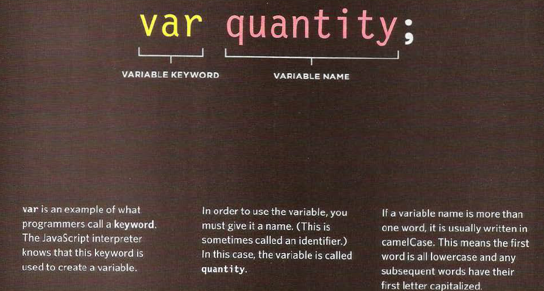
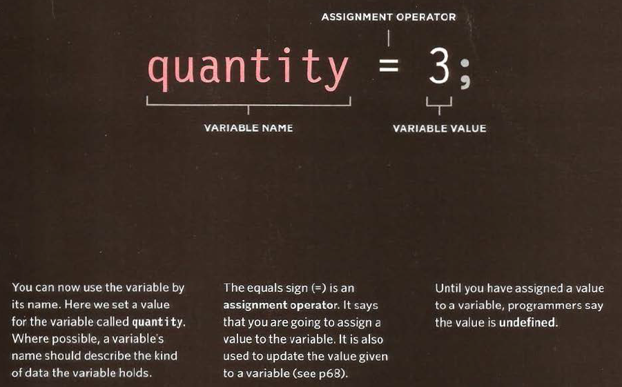
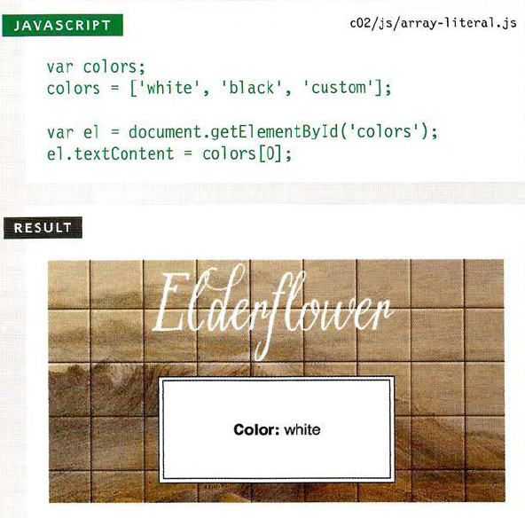
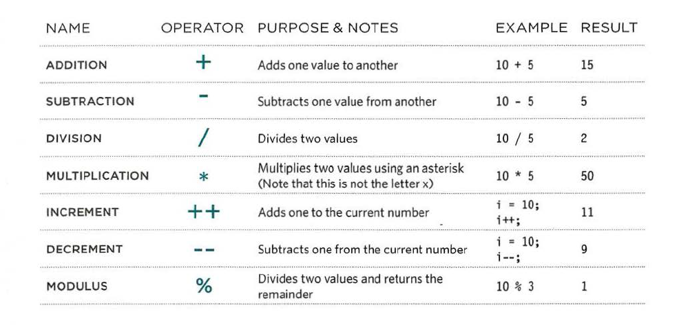
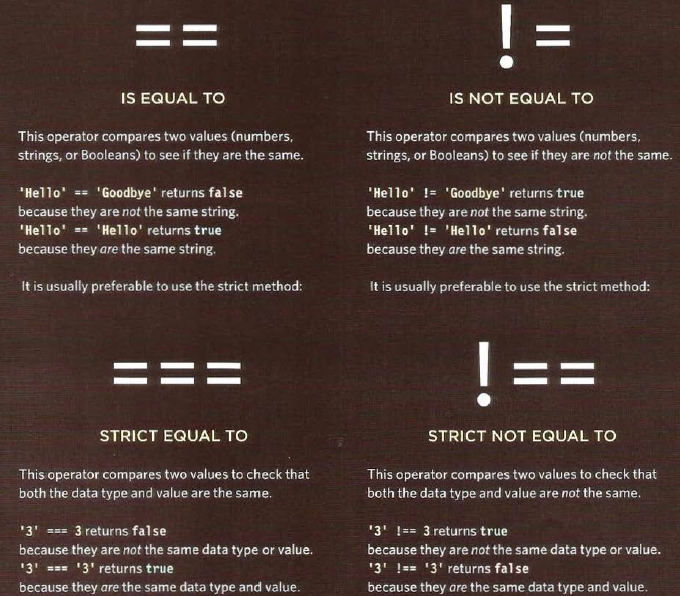
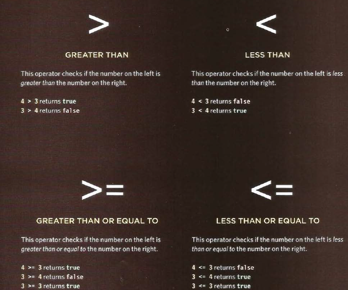
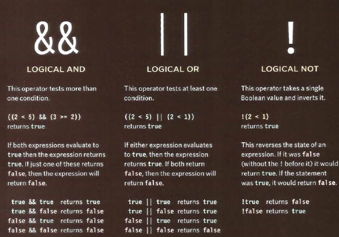

# HTML 

### Text

In this chapter we focus on how to add markup to the text that appears on your pages. You will learn about:

* **Structural markup:** the elements that you can use to describe both headings and paragraphs.

* **Semantic markup:** which provides extra information; such as where emphasis is placed in a sentence, that something you have written is a quotation (and who said it), the meaning of acronyms, and so on.

#### Headings

```

<h1>This is a Main Heading</h1>
<h2>This is a Level 2 Heading</h2>
<h3>This is a Level 3 Heading</h3>
<h4>This is a Level 4 Heading</h4>
<h5>This is a Level 5 Heading</h5>
<h6>This is a Level 6 Heading</h6>

```


#### Paragraphs

To create a paragraph, surround the words that make up the paragraph with an opening <p>
tag and closing </p> tag.
By default, a browser will show each paragraph on a new line with some space between it and
any subsequent paragraphs.

```

<p>A paragraph consists of one or more sentences
that form a self-contained unit of discourse. The
start of a paragraph is indicated by a new
line.</p>
<p>Text is easier to understand when it is split up
into units of text. For example, a book may have
chapters. Chapters can have subheadings. Under
each heading there will be one or more
paragraphs.</p>

```


#### Bold & Italic

By enclosing words in the tags `<b>` and `</b>` we can make
characters appear bold.
The `<b>` element also represents a section of text that would be presented in a visually different
way (for example key words in a paragraph) although the use of the `<b>` element does not imply
any additional meaning.

```

<p>This is how we make a word appear <b>bold.</b>
</p>
<p>Inside a product description you might see some
<b>key features</b> in bold.</p>

```


By enclosing words in the tags `<i>` and `</i>` we can make characters appear italic.
The `<i>` element also represents a section of text that would be said in a different way from surrounding content — such as technical terms, names of ships, foreign words, thoughts, or other
terms that would usually be italicized.

```

<p>This is how we make a word appear <i>italic</i>.
</p>
<p>It's a potato <i>Solanum teberosum</i>.</p>
<p>Captain Cook sailed to Australia on the
<i>Endeavour</i>.</p>

```


#### Superscript & Subscript

The `<sup>` element is used to contain characters that should be superscript such as the suffixes of dates or
mathematical concepts like raising a number to a power.

The `<sub>` element is used to contain characters that should be subscript. It is commonly
used with foot notes or chemical formulas.

```
<p>On the 4<sup>th</sup> of September you will learn
about E=MC<sup>2</sup>.</p>
<p>The amount of CO<sub>2</sub> in the atmosphere
grew by 2ppm in 2009<sub>1</sub>.</p>

```


#### Line Breaks & Horizontal Rules

As you have already seen, the browser will automatically show each new paragraph or heading on a new line. But if you wanted to add a line break inside the middle of a paragraph you can use the line break tag `<br />`.

```
<p>The Earth<br />gets one hundred tons heavier
every day<br />due to falling space dust.</p>

```



To create a break between themes — such as a change of topic in a book or a new scene in a play — you can add a
horizontal rule between sections using the `<hr />` tag.

```
<p>Venus is the only planet that rotates
clockwise.</p>
<hr />
<p>Jupiter is bigger than all the other planets
combined.</p>

```




#### Visual Editors & Their Code views

Content management systems and HTML editors such as Dreamweaver usually have two views of the page you are creating: a visual editor and a code view.

**Visual editors** often resemble word processors. Although each editor will differ slightly, there are some features that are common to most editors that allow you to control the presentation of text.

**Code views** show you the code created by the visual editor so you can manually edit it, or so you can just enter new code yourself. It is often activated using a button with an icon that says HTML or has angled
brackets. White space may be added to the code by the editor to make the code easier to read.


#### Semantic Markup


For example, you are going to meet the `<em>` element that allows you to indicate where emphasis should be placed on selected words and the `<blockquote>` element which indicates that a block of text is a quotation.
Browsers often display the contents of these elements in a different way. For example, the content of the `<em>` element is shown in italics, and a `<blockquote>` is usually indented. But you should not use them to change the way that your text looks; their purpose is to describe the content of your web pages more accurately. The reason for using these elements is that other programs, such as screen readers or search engines, can use this extra information. For example, the voice of a screen reader may add emphasis to the words inside the `<em>` element, or a search engine might register that your page features a quote if you use
the `<blockquote>` element.

#### Strong & Emphasis

The use of the `<strong>` element indicates that its content has strong importance.
For example, the words contained in this element might be said with strong emphasis.
By default, browsers will show the contents of a <strong> element in bold.

```

<p><strong>Beware:</strong> Pickpockets operate in
this area.</p>
<p>This toy has many small pieces and is <strong>not
suitable for children under five years old.
</strong></p>

```


The `<em>` element indicates emphasis that subtly changes the meaning of a sentence.
By default browsers will show the contents of an `<em>` element in italic.


```

<p>I <em>think</em> Ivy was the first.</p>
<p>I think <em>Ivy</em> was the first.</p>
<p>I think Ivy was the <em>first</em>.</p>

```


#### Quotations

There are two elements commonly used for marking up quotations:

* The `<blockquote>` element is used for longer quotes that take up an entire paragraph. Note how the <p> element is still used inside the `<blockquote>` element.
Browsers tend to indent the contents of the `<blockquote>` element, however you should not use this element just to indent a piece of text — rather you should achieve this effect using CSS.


* The `<q>` element is used for shorter quotes that sit within a paragraph. Browsers are supposed to put quotes around the `<q>` element, however Internet Explorer does not — therefore many people avoid using the `<q>` element. Both elements may use the cite attribute to indicate where the quote is from. Its value should be a URL that will have more information about the source of the quotation.

```

<blockquote cite="http://en.wikipedia.org/wiki/
Winnie-the-Pooh">
<p>Did you ever stop to think, and forget to start
again?</p>
</blockquote>
<p>As A.A. Milne said, <q>Some people talk to
animals. Not many listen though. That's the
problem.</q></p>

```


#### Abbreviations & Acronyms

If you use an abbreviation or an acronym, then the `<abbr>` element can be used. A title attribute on the opening tag is used to specify the full term.


```

<p><abbr title="Professor">Prof</abbr> Stephen
Hawking is a theoretical physicist and
cosmologist.</p>
<p><acronym title="National Aeronautics and Space
Administration">NASA</acronym> do some crazy
space stuff.</p>

```


# Css

### Understanding CSS

The key to understanding how CSS works is to imagine that there is an invisible box around
every HTML element.

### BLOCK & INLINE ELEMENTS

Block level elements look like they start on a new line. Examples include the `<h1>`-
`<h6>`, `<p>` and `<div>` elements.

Inline elements flow within the text and do not start on a new line. Examples include `<b>`, `<i>`,
``, `<em>` and `<span>`.

---

CSS allows you to create rules that control the way that each individual box (and the contents
of that box) is presented.

### Example Styles

**Boxes**
Width and height Borders (color, width, and style) Background color and images Position in the browser window.

**Text**
Typeface, SizeColor, Italics, bold, uppercase, lowercase, small-caps.

**Specific**
There are also specific ways in which you can style certain elements such as lists, tables, and forms.


### CSS Associates Style rules with HTML elements

CSS works by associating rules with HTML elements. These rules govern how the content of specified elements should be displayed. A CSS rule contains two parts: a selector and a declaration.


CSS works by associating rules with HTML elements. These rules govern how the content of specified elements should be displayed. A CSS rule contains two parts: a selector and a declaration.


---

### CSS Selectors

There are many different types of CSS selector that allow you to target rules to specific elements
in an HTML document.


### How Css Rules Cascade

If there are two or more rules that apply to the same element, it is important to understand which will take precedence.

**LAST RULE**
If the two selectors are identical, the latter of the two will take precedence. Here you can see
the second i selector takes precedence over the first.
**SPECIFICITY**
If one selector is more specific than the others, the more specific rule will take precedence
over more general ones. In this example: h1 is more specific than * p b is more specific than p p#intro is more specific than p
**IMPORTANT**
You can add !important after any property value to indicate that it should be considered more important than other rules that apply to the same element.


### Inheritance

If you specify the font-family or color properties on the `<body>` element, they will apply to most child elements. This is because the value of the font-family property is inherited by child elements. It
saves you from having to apply these properties to as many elements (and results in simpler style sheets).
You can compare this with the background-color or border properties; they are not inherited by child elements. If these were inherited by all child elements then the page could look quite messy. You can force a lot of properties to inherit values from their parent elements by using inherit for the value of the properties. In this example, the `<div>` element with a class called page inherits the padding size from the CSS rule that
applies to the `<body>` element.


### Why use External Style Sheets?
When building a website there are several advantages to placing your
CSS rules in a separate style sheet.

All of your web pages can share the same style sheet. This is achieved by using the `<link>` element on each HTML page of your site to link to the same CSS document. This means that the same code does not need to be
repeated in every page (which results in less code and smaller HTML pages).

---


# Javascript

### Basic JavaScript Instructions

#### STATEMENTS

A script is a series of instructions that a computer can follow one-by-one. Each individual instruction or step is known as a statement. Statements should end with a semicolon.



* Each of the lines of code in green is a statement.
* The pink curly braces indicate the start and end of a code block. (Each code block could contain many more statements.)
* The code in purple determines which code should run (as you will see on p149).

**JAVASCRIPT IS CASE SENSITIVE**
JavaScript is case sensitive so hourNow means something different to HourNow or HOURNOW.

#### COMMENTS

You should write comments to explain what your code does. They help make your code easier to read and understand. This can help you and others who read your code.

**MULTI-LINE COMMENTS**
To write a comment that stretches over more than one line, you use a multi-line comment, starting with
the `/*` characters and ending with the `*/` characters. Anything between these characters is not processed·
by the JavaScript interpreter.

**SINGLE-LINE COMMENTS**
In a single-line comment, anything that follows the two forward slash characters `//` on that line will not
be processed by the JavaScript interpreter. Singleline comments are often used for short descriptions
of what the code is doing.

---

### WHAT IS A VARIABLE?

A script will have to temporarily store the bits of information it needs to do its job. It can store this
data in variables.

A variable is a good name for this concept because the data stored in a variable can change (or vary)
each time a script runs.

### How to declare variables?



### How to assign variables?



---

### DATA TYPES
JavaScript distinguishes between numbers, strings, and true or false values known as Booleans.
**NUMERIC DATA TYPE**
The numeric data type handles numbers.

**STRING DATA TYPE**
The strings data type consists of letters and other characters.

**BOOLEAN DATA TYPE**
Boolean data types can have one of two va lues: true or false.

---

### ARRAYS

An array is a special type of variable. It doesn't just store one value; it stores a list of values.

You should consider using an array whenever you are working with a list or a set of values that
are related to each other.

Arrays are especially helpful when you do not know how many items a list will contain
because, when you create the array, you do not need to specify how many values it will hold.

For example, an array can be suited to storing the individual items on a shopping list because
it is a list of related items.
Additionally, each time you write a new shopping list, the number of items on it may differ.

#### CREATING AN ARRAY



This technique for creating an array is known as an array literal. It is usually the preferred
method for creating an array.
You can also write each value on a separate line:
`colors= ['white', 'black', 'custom'];`


you can see an array created using a different technique called an array constructor. This uses the new
keyword followed by Array(); The va lues are then specified in parentheses (not squarebrackets), and each value is separated by a comma. You can also use a method called i tern()to retrieve data from the array.
(The index number of the item is specified in the parentheses.)

The array literal (shown in the first code sample) is preferred over the
array constructor when creating arrays.

---

#### EXPRESSIONS

An expression evaluates into (results in) a single value. Broadly speaking
there are two types of expressions.
**1. EXPRESSIONS THAT JUST ASSIGN A VALUE TO A VARIABLE**
In order for a variable to be useful, it needs to be given a value. As you have seen, this is done using
the assignment operator (the equals sign).
`var color = 'beige';`
The value of color is now beige.

**2. EXPRESSIONS THAT USE TWO OR MORE VALUES TO RETURN A SINGLE VALUE**
You can perform operations on any number of individual values (see next page) to determine a single value. 
For example:
`var area = 3 * 2;`
The value of area is now 6.

### ARITHMETIC OPERATORS

JavaScript contains the following mathematical
operators, which you can use with numbers.




### Decisions and Loops

Scripts often need to behave differently depending upon how the user interacts with the web
page and/or the browser window itself. To determine which path to take, programmers often
rely upon the following three concepts:

**EVALUATIONS**
You can analyze values in your scripts to determine whether or note they match expected results.

**DECISIONS**
Using the results of evaluations, you can decide which path your script should go down.

**LOOPS**
There are also many occasions where you will want to perform the same set of steps repeatedly.


### Comparison operators





### Logical operators




