# HTML Lists

There are lots of occasions when we need to use lists. HTML provides us with three different types:

1. Ordered lists are lists where each item in the list is numbered. For example, the list might be a set of steps for a recipe that must be performed in order, or a legal contract where each point needs to be identified by a section number.

The ordered list is created with the `<ol>` element.
Each item in the list is placed between an opening `<li>` tag and a closing `</li>` tag.
(The li stands for list item.)

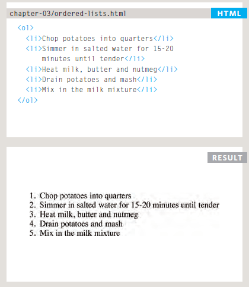

2. Unordered lists are lists that begin with a bullet point (rather than characters that indicate order).

The unordered list is created with the `<ul>` element.
Each item in the list is placed between an opening `<li>` tag and a closing `</li>` tag.
(The li stands for list item.)

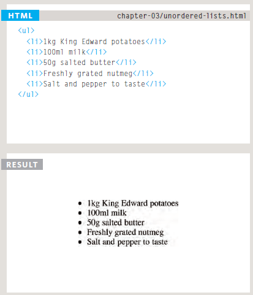

3. Definition lists are made up of a set of terms along with the definitions for each of those terms.

The definition list is created with the `<dl>` element and usually consists of a series of terms and
their definitions. Inside the `<dl>` element you will usually see pairs of `<dt>` and `<dd>` elements.

`<dt>` This is used to contain the term being defined (the definition term).
`<dd>` This is used to contain the definition.

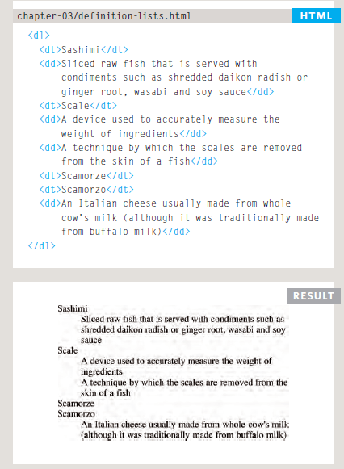

---

### Nested List

You can put a second list inside an `<li>` element to create a sublist or nested list.


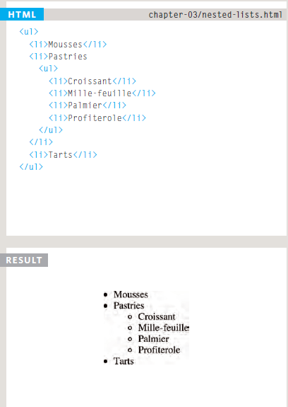

---

# Css Boxes

At the beginning of CSS, you saw how CSS treats each HTML element as if it lives in its own box.

You can set several properties that affect the appearance of these boxes.you will see how to:

* Control the dimensions of your boxes
* Create borders around boxes
* Set margins and padding for boxes
* Show and hide boxes

### Box Dimensions

**Width, height**

By default a box is sized just big enough to hold its contents. To set your own dimensions for a
box you can use the height and width properties.

The most popular ways to specify the size of a box are to use pixels, percentages, or ems. Traditionally, pixels have been the most popular method because they allow designers to accurately control their size.

When you use percentages, the size of the box is relative to the size of the browser window or, if the box is encased within another box, it is a percentage of the size of the containing box.

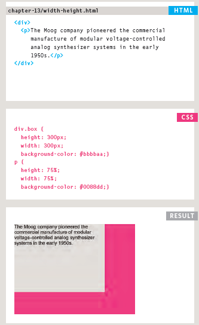


**Limiting Width min-width, max-width**

Some page designs expand and shrink to fit the size of the user's screen. In such designs, the min-width property specifies the smallest size a box can be displayed at when the browser window is narrow, and the
max-width property indicates the maximum width a box can stretch to when the browser window is wide.

These are very helpful properties to ensure that the content of pages are legible (especially on the smaller screens of handheld devices). For example, you can use the max-width property to ensure that lines of text do not appear too wide within a bigbrowser window and you can use the min-width property
to make sure that they do not appear too narrow.

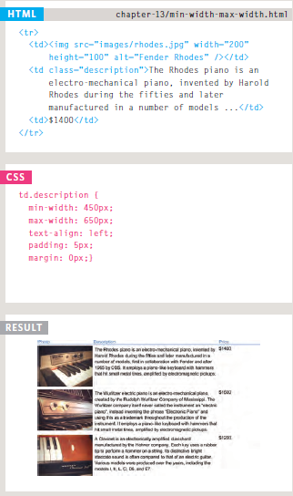


**Limiting Height min-height, max-height**

In the same way that you might want to limit the width of a box on a page, you may also want to limit the height of it. This is achieved using the min-height and max-height properties. The example on this page demonstrates these properties in action. It also shows you what happens when the content of the box takes up more space than the size specified for the box. If the box is not big enough to hold the content, and the content expands outside the box it canlook very messy. To control what happens when there is not enough space for the content of a box, you can use the overflow property, which is discussed on the next page.

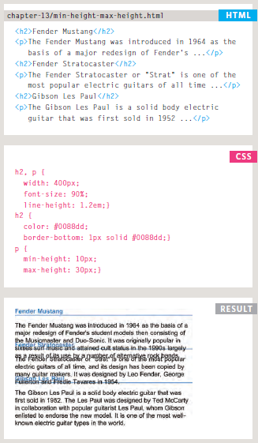

**Overflowing Content overflow**

The overflow property tells the browser what to do if the content contained within a box is larger than the box itself. It can have one of two values:
1. hidden

This property simply hides any extra content that does not fit in the box.

2. scroll
This property adds a scrollbar to the box so that users can scroll to see the missing content.

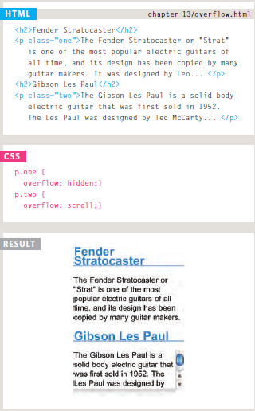

you can see two boxes whose contents expand beyond their set dimensions. The first example has the overflow
property with a value of hidden. The second example has the overflow property with a value of scroll.
The overflow property is particularly handy because some browsers allow users to adjust the size of the text to appear as large or as small as they want. If the text is set too large then thepage can become an unreadable
mess. Hiding the overflow on such boxes helps prevent items overlapping on the page.


**Border, Margin & Padding**

Every box has three available properties that can be adjusted to control its appearance:

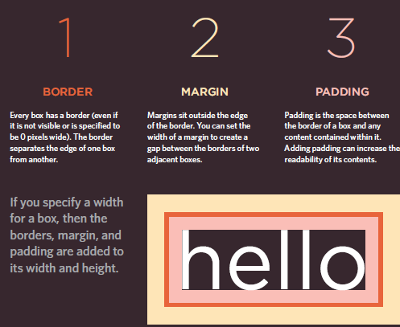

**White space & Vertical Margin**

The padding and margin properties are very helpful in adding spacebetween various items on the page.

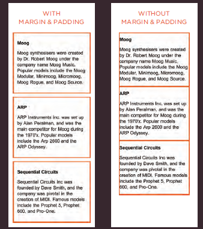


**Border Width**

The border-width property is used to control the width of a border. The value of this property can either be given in pixels or using one of the following values:
```
thin
medium
thick
```
(You cannot use percentages with this property).

You can control the individual size of borders using four separate properties:
```
border-top-width
border-right-width
border-bottom-width
border-left-width
```
You can also specify different widths for the four border values in one property,

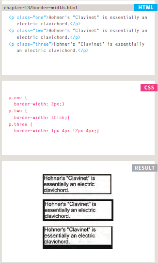

**Change Inline/Block display**

The display property allows you to turn an inline element into a block-level element or vice versa, and can also be used to hide an element from the page. The values this property can take are:

1. inline
This causes a block-level element to act like an inline element.
2. block
This causes an inline element to act like a block-level element.
3. inline-block
This causes a block-level element to flow like an inline element, while retaining other
features of a block-level element.
4. none
This hides an element from the page. In this case, the element acts as though it is not on the page at all (although a user could still see the content of the box if they used the view source option in their browser).

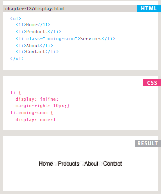

**Hiding Boxes visibility**

The visibility property allows you to hide boxes from users but It leaves a space where the element would have been. This property can take two values:
1. hidden
This hides the element.
2. visible
This shows the element.

If the visibility of an element is set to hidden, a blank space will appear in its place.
If you do not want a blank space to appear, then you should use the display property with
a value of none instead.

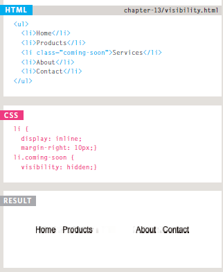


# JavaScript

### Switch Statements

A switch statement starts with a variable called the switch value. Each case indicates a possible value for this variable and the code that should run if the variable matches that value.

```
switch (level) {
case 'One':
title= 'Level 1' ;
break;
case 'Two':
title = 'Level 2' ;
break;
case 'Three':
title = 'Level 3' ;
break ;
default :
title= 'Test';
break;
```
Here, the variable named 1 eve l is the switch value. If the value of the l eve 1 variable is the string One,
then the code for the first case is executed. If it is Two, the second case is executed. If it is Three, the third case is executed. If it is none of these, the code for the defaul t case is executed. The entire statement lives in one code block (set of curly braces), and a colon separates the option from the statements that are to be run if the case matches the switch value. At the end of each case is the break keyword. It tells
the JavaScript interpreter that it has finished with this switch statement and to proceed to run any
subsequent code that appears after it.

### Loops

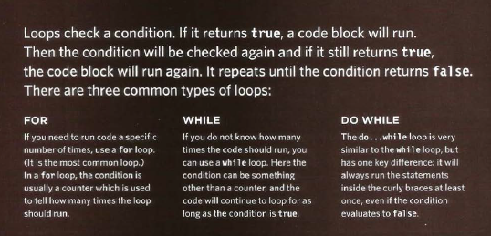
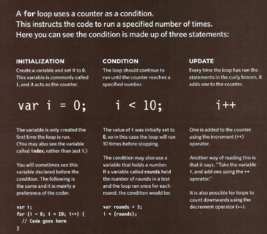

### Using Loops

1. For loop

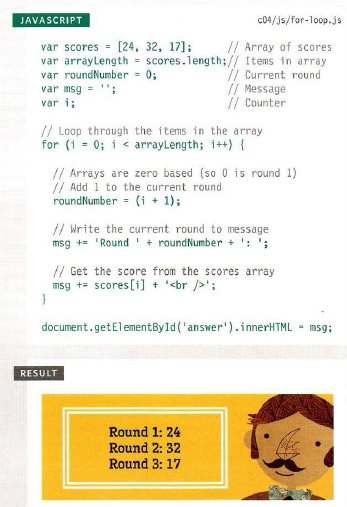

2. While loop

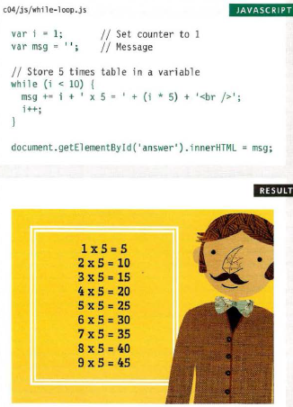

3. Do while loop

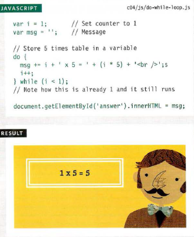

