# HTML

### Links

Links are the defining feature of the web because they allow you to move from one web page to another  enabling the very idea of browsing or surfing.

You will commonly come across the following types of links:

* Links from one website to another
* Links from one page to another on the same website
* Links from one part of a web page to another part of the same page
* Links that open in a new browser window
* Links that start up your email program and address a new email to someone

### Writing Links

Links are created using the `<a>` element. Users can click on anything between the opening `<a>` tag and the closing `</a>` tag. You specify which page you want to link to using the href attribute.

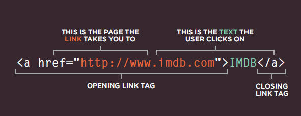

When you link to a different website, the value of the href attribute will be the full web
address for the site, which is known as an absolute URL.

### Linking to Other Pages on the Sa me Site

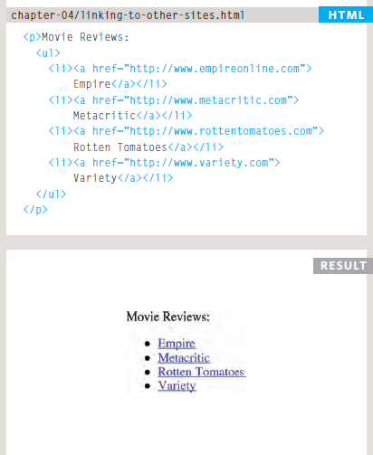

When you are linking to other pages within the same site, you do not need to specify the domain name in the URL. You can use a shorthand known as a relative URL.

### Directory Structure

On larger websites it's a good idea to organize your code by placing the pages for each different section of the site into a new folder. Folders on a website are sometimes referred to as directories.

See this Example:

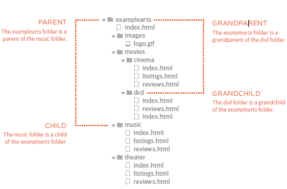

### Rela tive UR Ls

Relative URLs can be used when linking to pages within your own website. They provide a shorthand way of telling the browser where to find your files.

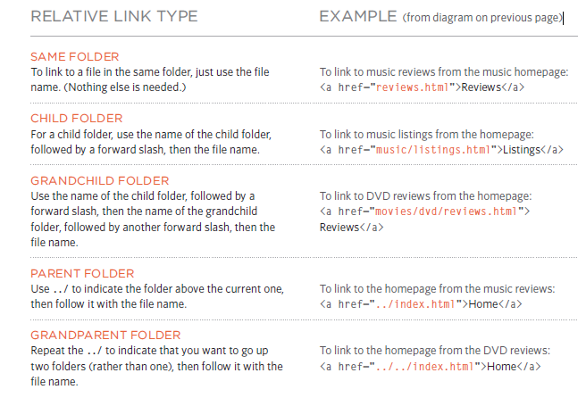

### Opening Links in a New Window

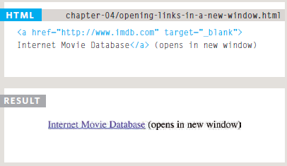

### Linking to a Sp ecific Part of the Sa me Page

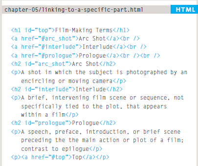

At the top of a long page you might want to add a list of contents that links to the corresponding sections lower down. Or you might want to add a link from part way down the page back to the top of it to save users from having to scroll backto the top. Before you can link to a specific part of a page, you need to identify the points in the page that the link will go to. You do this using the id attribute (which can be used on every HTML element). You can see that the `<h1>` and `<h2>` elements in this example have been given id
attributes that identify those sections of the page.The value of the id attribute should start with a letter or an underscore (not a number or any other character) and, on a single page, no two id attributes should have the same value. To link to an element that uses an id attribute you use the `<a>` element again, but the value of the href attribute starts with the # symbol, followed by the value of the id attribute of the element you want to link to. In this example, `<a href="#top">` links to the `<h1>` element at the top of the page whose id
attribute has a value of top.

---

# CSS

### Layout

how to control where each element sits on a page and how to create attractive page layouts.

This involves learning about how designing for a screen can be different to designing for other mediums (such as print). In this chapter we will:

* Explore different ways to position e ●● lements using normal flow, relative positioning, absolute positioning and floats.

* Discover how various devices have different screen sizes and resolution, and how this affects the design process.
* Learn the difference between fixed width and liquid layouts, and how they are created.
* Find out how designers use grids to make their page designs look more professional.

### Key Concepts in Positioning El ements

**Building Blocks**

CSS treats each HTML element as if it is in its own box. This box will either be a block-level
box or an inline box.

Block-level boxes start on a new line and act as the main building blocks of any layout, while inline boxes flow between surrounding text. You can control how much space each box takes up by setting the width of the
boxes (and sometimes the height, too).
To separate boxes, you can use borders, margins, padding, and background colors.

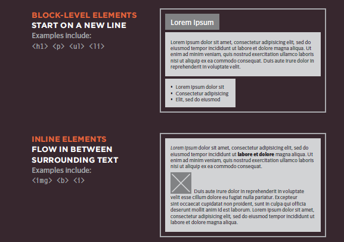

**Containing Elements**

If one block-level element sits inside another block-level element then the outer box is known as the containing or parent element. It is common to group a number of elements together inside a `
` (or other block-level) element. For example, you might group together all of the elements that form the header of a site (such as the logo and the main navigation). The `
` element that contains this group of
elements is then referred to as the containing element.

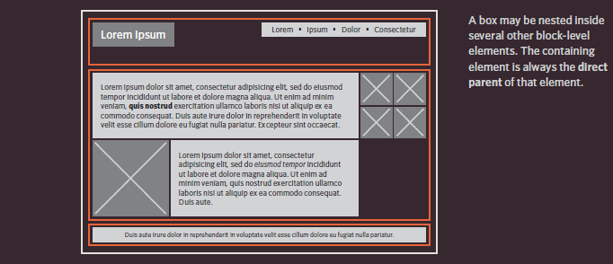

The orange lines in this diagram represent `
` elements. The header (containing the logo and navigation) are in one `
` element, the main content of the page is in another, and the footer is in a third. The `<body>` element is the containing element for these three `
` elements. The second `
` element is the containing element for two paragraphs of Latin text and images (represented by crossed squares).

### Controll ing the Position of El ements

CSS has the following positioning schemes that allow you to control the layout of a page: normal flow, relative positioning, and absolute positioning. You specify the positioning scheme using the position
property in CSS. You can also float elements using the float property.

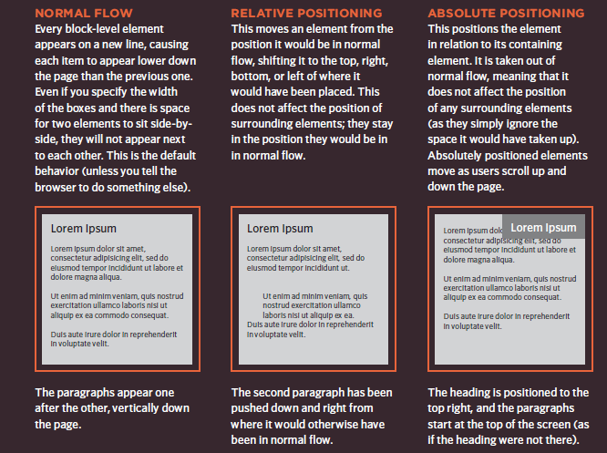

To indicate where a box should be positioned, you may also need to use box offset properties to tell the browser how far from the top or bottom and left or right it should be placed. (You will meet these when we
introduce the positioning schemes on the following pages.)

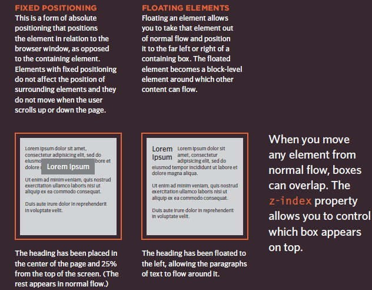

---

# javascript - Functions, Methods, and Objects

Browsers require very detailed instructions about what we want them to do. Therefore, complex scripts can run to hundreds (even thousands) of lines. Programmers use functions, methods, and objects to organize their code.

### FUNCTIONS METHODS

Functions consist of a series of statements that have been grouped together because they perform a specific task. A method is the same as a function, except methods are created inside (and are part of) an object.

**WHAT IS A FUNCTION?**

Functions let you group a series of statements together to perform a specific task. If different parts of a script repeat the same task, you can reuse the function (rather than repeating the same set of st atements).

**Declaring a function**

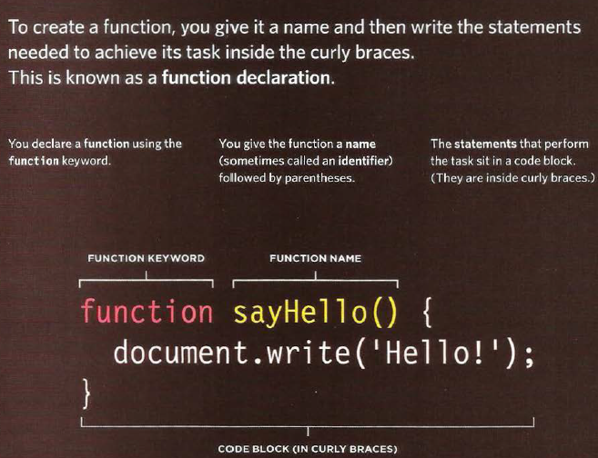

**Calling a function**

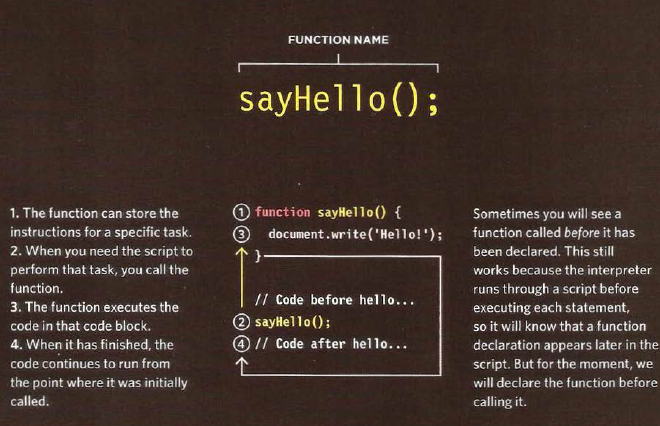

**Declaring functions that need information**

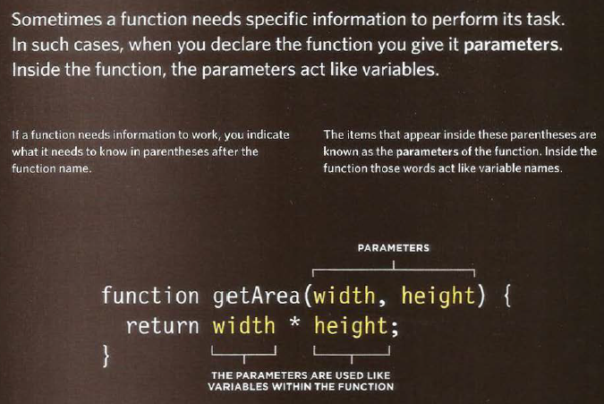

### OBJECTS

In Chapter 1 you saw that programmers use objects to create models of the world using data, and that objects are made up of properties and methods. In this section, you learn how to create your own objects using JavaScript.

### BUILT-IN OBJECTS

The browser comes with a set of objects that act like a toolkit for creating interactive web pages.
This section introduces you to a number of built-in objects, which you will then see used throughout the rest of the book.

---

# Pair Programming 

terative loops. Code reviews. Fast feedback. Error checking and linting. These are software engineering practices that have proven to dramatically improve the quality of code developers produce. What if you can could get all of this, instantaneously, while typing code line by line and character by character? You can, with pair programming, a technique common to many agile work environments.

More “two heads are better than one” than “stop reading over my shoulder,” pair programming is the practice of two developers sharing a single workstation to interactively tackle a coding task together. At Code Fellows, pair programing is one way we foster a collaborative environment while developing key industry skills.

**How does pair programming work?**

While there are many different styles, pair programming commonly involves two roles: the Driver and the Navigator. The Driver is the programmer who is typing and the only one whose hands are on the keyboard. Handling the “mechanics” of coding, the Driver manages the text editor, switching files, version control, and—of course writing—code. The Navigator uses their words to guide the Driver but does not provide any direct input to the computer. The Navigator thinks about the big picture, what comes next, how an algorithm might be converted in to code, while scanning for typos or bugs. The Navigator might also utilize their computer as a second screen to look up solutions and documentation, but should not be writing any code.

**Why pair program?**

While learning to code, developers likely study several programming languages. Similar to a foreign language class, there are four fundamental skills that help anyone learn a new language: Listening: hearing and interpreting the vocabulary Speaking: using the correct words to communicate an idea Reading: understanding what written language intends to convey Writing: producing from scratch a meaningful

Pair programming touches on all four skills: developers explain out loud what the code should do, listen to others’ guidance, read code that others have written, and write code themselves.
