# HTML

### Images 

A picture can say a thousand words, and great images help make the difference between an average-looking site and a really engaging one.

**Storing Images on Your Site**

If you are building a site from scratch, it is good practice to create a folder for all of the images
the site uses.

As a website grows, keeping images in a separate folder helps you understand how thesite is organized. Here you can see an example of the files for a website; all of the images are stored in a folder called images.

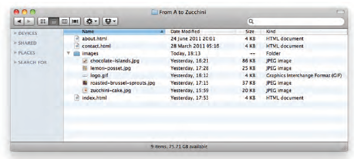

**Adding Images**

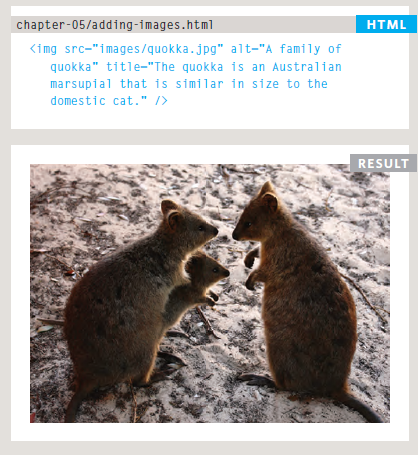

**Height & Width of Images**

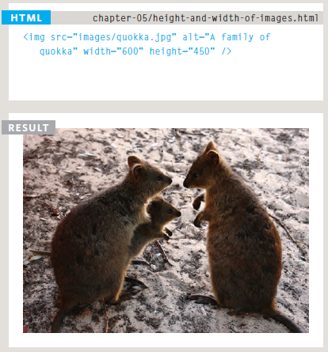

**Three Rules for Creating Images**

1. Save images in the right format. 
Websites mainly use images in jpeg, gif, or png format. If you choose the wrong image format then your image might not look as sharp as it should and can make the web page slower to load.

2. Save images at the right size.
You should save the image at the same width and height it will appear on the website. If the image is smaller than the width or height that you have specified, the image can be distorted and stretched. If the image is larger than the width and height if you have specified, the image will take longer to display on the page.

3. Use the correct resolution.
Computer screens are made up of dots known as pixels. Images used on the web are also made up of tiny dots. Resolution refers to the number of dots per inch, and most computer screens only show web pages at 72 pixels per inch. So saving images at a higher resolution results in images that are larger than necessary and take longer to download.

**Tools to Edit & Save Images**

There are several tools you can use to edit and save images to ensure that they are the right
size, format, and resolution.

The most popular tool amongst web professionals is Adobe Photoshop. (In fact, professional web designers often use this software to design entire sites.) The full version of Photoshop is expensive, but there is a cheaper
version called Photoshop Elements which would suit the needs of most beginners.

**Image Di mensions**

The images you use on your website should be saved at the same width and height that you
want them to appear on the page.

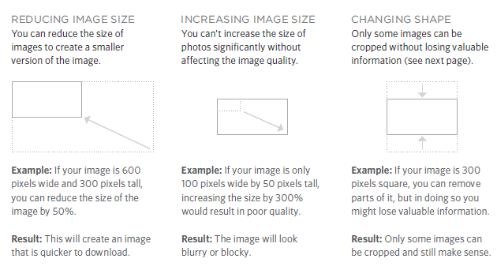

**Cropping Images**

When cropping images it is important not to lose valuable information. It is best to source
images that are the correct shape if possible.

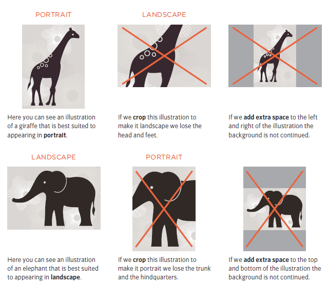

**Image Resolution**

Images created for the web should be saved at a resolution of 72 ppi. The higher the resolution
of the image, the larger the size of the file.

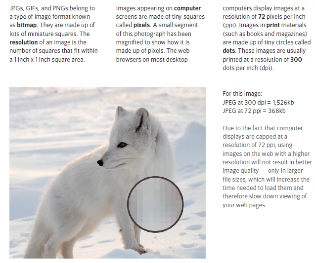

**Vector Images**

Vector images differ from bitmap images and are resolution-independent. Vector images are
commonly created in programs such as Adobe Illustrator.

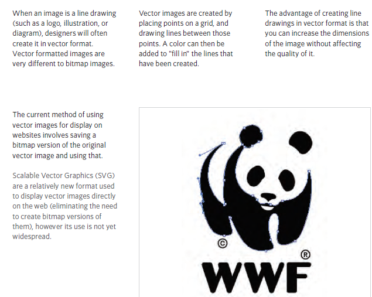

**Animated GIFs**

Animated GIFs show several frames of an image in sequence and therefore can be used to
create simple animations.

It is important to remember:
Each extra frame of the image increases the size of the file, and can therefore add to the time it takes for an image to download (and web users do not like waiting a long time for images to download). 
Because GIFs are not an ideal format for displaying photographs, animated GIFs are really only suitable for simple illustrations.

**Transparency**

Creating an image that is partially transparent (or "see-through") 
for the web involves selecting one of two formats:

1. Transparent GIF
If the transparent part of the image has straight edges and it is 100% transparent (that is,
not semi-opaque), you can save the image as a GIF (with the transparency option selected).

2. PNG
If the transparent part of the image has diagonal or rounded edges or if you want a semiopaque
transparency or a dropshadow, then you will need to save it as a PNG.

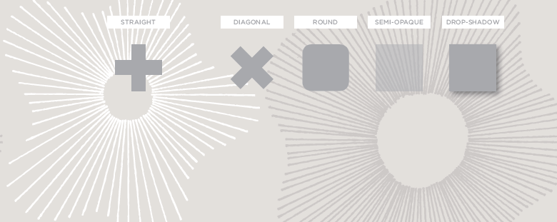

**Figure and Figure Caption**

Images often come with captions. HTML5 has introduced a new `<figure>` element to contain images and their caption so that the two are associated. You can have more than one image inside the `<figure>`
element as long as they all share the same caption.

The `<figcaption>` element has been added to HTML5 in order to allow web page authors to add
a caption to an image.

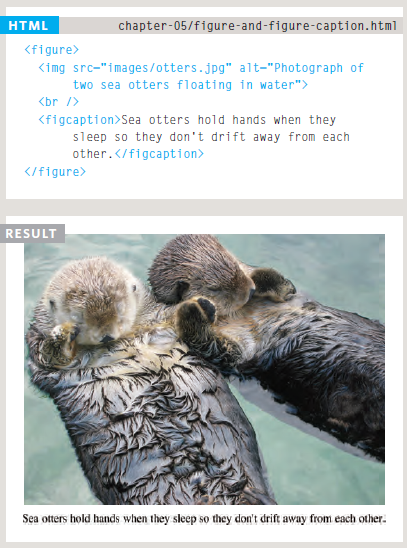

---

# CSS

### Color

**Foreground Color**

The color property allows you to specify the color of text inside an element. You can specify any
color in CSS in one of three ways:

1. rgb values

2. hex codes

3. color names

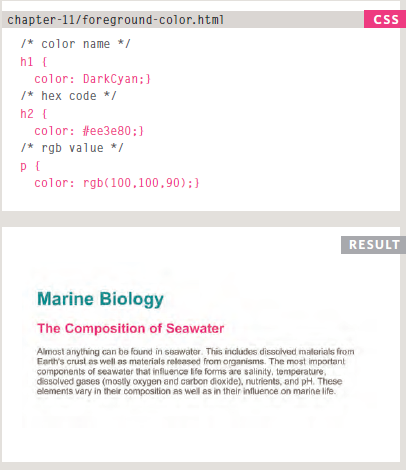

**Background Color**

CSS treats each HTML element as if it appears in a box, and the background-color property
sets the color of the background for that box.

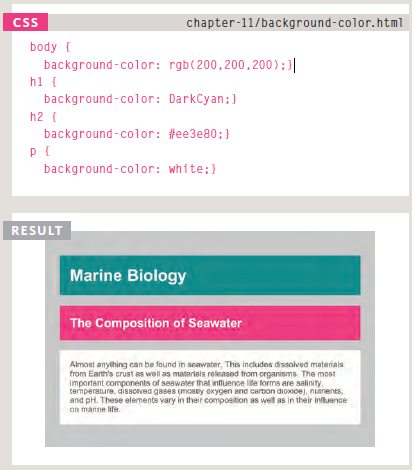

**Understanding Color**

Every color on a computer screen is created by mixing amounts of red, green, and blue. To find the color you want, you can use a color picker.

Color pickers can help you find the color you want.

It is important to ensure that there is enough contrast between any text and the background color (otherwise
people will not be able to read your content).

CSS3 has introduced an extra value for RGB colors to indicate opacity. It is known as RGBA.

CSS3 also allows you to specify colors as HSL values, with an optional opacity value. It is known as HSLA.

---

### Text

The properties that allow you to control the appearance of text can be split into two groups:

Those that directly affect the font and its appearance (including the typeface, whether it is regular, bold or italic, and the size of the text)

Those that would have the same effect on text no matter what font you were using (including the color of text and the spacing between words and letters).

**Typeface Terminology**

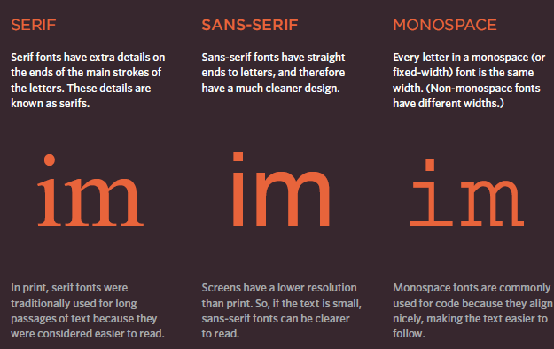

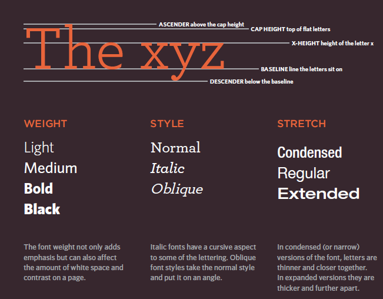

**Specifying Typefaces font-family**

The font-family property allows you to specify the typeface that should be used for
any text inside the element(s) to which a CSS rule applies.

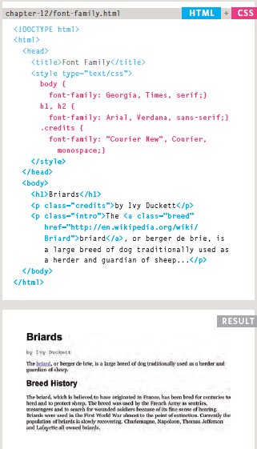

You can specify a list of fonts separated by commas so that, if the user does not have your
first choice of typeface installed, the browser can try to use an salternative font from the list.

**Size of Type Size of Type**

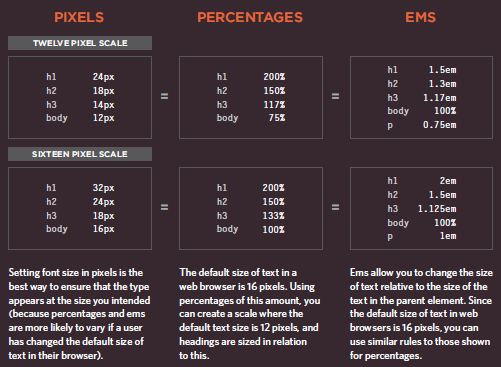

**font-style**

If you want to create italic text, you can use the font-style property. 
There are three values this property can take:

1. normal
This causes text to appear in a normal style (as opposed to italic or oblique).

2. italic
This causes text to appear italic. 

3. oblique
This causes text to appear oblique.

**UpperCase & LowerCase text-transform**

The text-transform propertyis used to change the case of text giving it one of the following values:

1. uppercase
This causes the text to appear uppercase.

2. lowercase
This causes the text to appear lowercase.

3. capitalize
This causes the first letter of each word to appear capitalized.

**Underline & Strike text-decoration**

The text-decoration property allows you to specify the following values:

* none
This removes any decoration already applied to the text.

* underline
This adds a line underneath the text.

* overline
This adds a line over the top of the text.

* line-through
This adds a line through words.

* blink
This animates the text to make it flash on and off (however this is generally frowned upon, as it is
considered rather annoying).

**Leading line-height**

Leading (pronounced ledding) is a term typographers use for the vertical space between lines of text. In a typeface, the part of a letter that drops beneath the baseline is called a descender,while the highest point of a letter is called the ascender. Leading is measured from the bottom of the descender on one line to the
top of the ascender on the next.

**Lett er & Word Spacing letter-spacing, word-spacing**

Kerning is the term typographers use for the space between each letter. You cancontrol the space between each
letter with the letter-spacing property. It is particularly helpful to increase the kerning when your heading or sentence is all in uppercase. If your text is in sentence (or normal) case, increasing or decreasing the
kerning can make it harder to read. You can also control the gap between words using the word-spacing property.
When you specify a value for these properties, it should be given in ems, and it will be added on top of the default value specified by the font.

**Alignment text-align**

The text-align property allows you to control the alignment of text.
The property can take one of four values:

1. left
This indicates that the text should be left-aligned.

2. right
This indicates that the text should be right-aligned.

3. center
This allows you to center text.

4. justify 
This indicates that every line in a paragraph, except the last line, should be set to take up the full width of the containing box.

**First Lett er or Line :first-letter, :first-line**

You can specify different values for the first letter or first line of text inside an element using
:first-letter and :first-line.
Technically these are not properties. They are known as pseudo-elements.
You specify the pseudo-element at the end of the selector, and then specify the declarations as you would normally for any other element.

**Styling Links :link, :visited**

Browsers tend to show links in blue with an underline by default, and they will change the color of links that have been visited to help users know which pages they have been to. In CSS, there are two pseudoclasses that allow you to set different styles for links that have and have not yet been visited.

* :link
This allows you to set styles for links that have not yet been visited.

* :visited
This allows you to set styles for links that have been clicked on.

**Responding to Us ers :hover, :active, :focus**

There are three pseudo-classes that allow you to change the appearance of elements when a
user is interacting with them.

* :hover
This is applied when a user hovers over an element with a
pointing device such as a mouse.

* :active
This is applied when an element
is being activated by a user; for
example, when a button is being
pressed or a link being clicked.

* :focus
This is applied when an element has focus.

**Attribute Selectors**

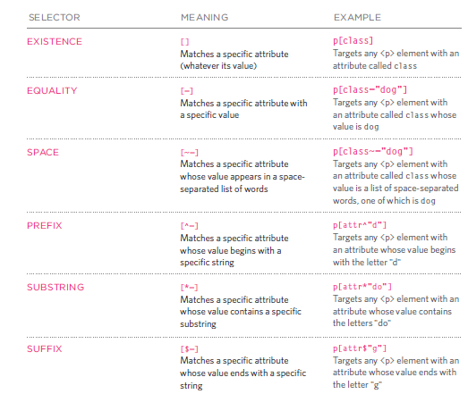

---

# JPEG vs PNG vs GIF — which image format to use and when?

we would only be looking at the three most commonly used image formats in websites and mobile applications — JPEG, PNG and GIF. Several statistics reports, including the one from HTTP Archive, indicate that these 3 formats together comprise of more than 95% of all images loaded on websites. However, these 3 image formats have significant differences amongst themselves thus making each of them suitable for specific use cases. Understanding these major differences would help us deliver the best possible images to our website and mobile app users.

Use JPEG format for all images that contain a natural scene or photograph where variation in colour and intensity is smooth. Use PNG format for any image that needs transparency or for images with text & objects with sharp contrast edges like logos. Use GIF format for images that contain animations.