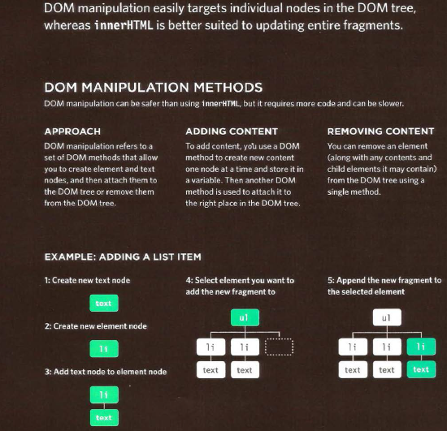

# Object Literals

### WHAT IS AN OBJECT?

Objects group together a set of variables and functions to create a model of a something you would recognize from the real world. In an object, variables and functions take on new names.


**IN AN OBJECT: VARIABLES BECOME KNOWN AS PROPERTIES**

If a variable is part of an object, it is called a property. Properties te ll us about the object, 
such as the name of a hotel or the number of rooms it has. Each individual hotel might have a different name
and a different number of rooms.

**IN AN OBJECT: FUNCTIONS BECOME KNOWN AS METHODS**

If a function is part of an object, it is called a method. Methods represent tasks that are associated with
the object. For example, you can check how many rooms are available by subtracting the number of
booked rooms from the total number of rooms.


This object represents a hotel. It has five properties and one method.
The object is in curly braces. It is stored in a variable called hotel .

Like variables and named functions, properties and methods have a name and a va lue. In an object,
that name is called a key.

An object cannot have two keys with the same name. This is because keys are used to access
their corresponding values.

The value of a property can be a st ring, number, Boolean, array, or even another object. The va lue of a
method is always a function.


---

### Creating an object: Litiral notation

Litiral notation is the easiest and most popular way to create objects.


### Accessing an objecta and dot notation

You can access the properties or methods of an object using dot notation.
You can also access properties using square brackets.


---

# Document Object Model

The Document Object Model (DOM) specifies how browsers should create a model of an HTML page and how JavaScript can access and update the contents of a web page while it is in the browser window.

The DOM is neither part of HTML, nor part of JavaScript; it is a separate set of rules.
It is implemented by all major browser makers, and covers two primary areas:

**MAKING A MODEL OF THEHTML PAGE**

When the browser loads a web page, it creates a model of the page in memory. The DOM specifies the way in which the browser should structure this model using a DOM tree.
The DOM is called an object model because the model (the DOM tree) is made of objects.
Each object represents a different part of the page loaded in the browser window.

**ACCESSING AND CHANGINGTHE HTML PAGE**

The DOM also defines methods and properties to access and update each object in this model, which in turn updates what the user sees in the browser. You will hear people call the DOM an Application Programming Interface (API). User interfaces let humans interact with programs; APls let programs (and scripts)
talk to each other. The DOM states what your script can "ask the browser about the current page, and how to tell the browser to update what is being shown to the user.


### THE DOM TREE IS A MODEL OF A WEB PAGE

As a browser loads a web page, it creates a model of that page. The model is called a DOM tree, and it is stored in the browsers' memory. It consists of four main types of nodes.

BODY OF HTML PAGE

```
<html>
    <body>
        <di v id="page">
            <hl id="header">List</hl>
                <h2>Buy groceries</h2>
                    <ul>
                        <li id="one" class="hot"><em>fresh</em> figs</li>
                        <li id="two" class="hot">pine nuts</l i>
                        <l i id="three" class="hot">honey</l i>
                        <l i id="four">balsamic vinegar</l i>
                    </ ul>
            <script src="js/l i st. js "></scri pt>
        </ div>
    </ body>
</ html>
```

**THE DOCUMENT NODE**

Above, you can see the HTML code for a shopping list, and on the right hand page is its DOM tree. Every element, attribute, and piece of text in the HTML is represented by its own DOM node. At the top of the tree a document node is added; it represents the entire page (and also corresponds to the document object, which you first met on p36). When you access any element, attribute, or text node, you navigate to it via the document node. It is the starting point for all visits to the DOM tree.

**ELEMENT NODES**

HTML elements describe the structure of an HTML page. (The `<h1>` - `<h6>` elements describe what parts are headings; the `<p>` tags indicate where paragraphs of text start and finish; and so on.) To access the DOM tree, you start by looking for elements. Once you find the element you want, then you can access its text and attribute nodes if you want to. This is why you start by learning methods that allow you to access element nodes, before learning to access and alter text or attributes.


Each node is an object with methods and properties. Scripts access and update this DOM tree (not the source HTML file). Any changes made to the DOM tree are reflected in the browser.


### WORKING WITH THE DOM TREE

Accessing and updating the DOM tree involves two steps:
1: Locate the node that represents the element you want to work with.
2: Use its text content, child elements, and attributes.


The terms elements and element nodes are used interchangeably but when people say the DOM is working with an element, it is actually working with a node that represents that element.


### Caching Dom queries


### Methods can select individual elements


### selecting an element from a nodelist


### Repeating actions for  an entire nodelist


### Adding or removing html content





