## Domain Modeling

Domain modeling is the process of creating a conceptual model in code for a specific problem. A model describes the various entities, their attributes and behaviors, as well as the constraints that govern the problem domain. An entity that stores data in properties and encapsulates behaviors in methods is commonly referred to as an **object-oriented** model.

A domain model that's articulated well can verify and validate the understanding of a specific problem among various stakeholders. As a communication tool, it defines a vocabulary that can be used within and between both technical and business teams.

### Model epic fails videos

Imagine you've been tasked to build a program that models the popularity of [epic fail](http://www.urbandictionary.com/define.php?term=epic+fail) videos. After months of painstaking research, you've determined that the two essential metrics for gauging popularity are **an epic rating** and **whether or not the video has animals**.

Since you'll be modeling the popularity of many types of videos—parkour epic fails, corgi epic fails, etc.—you'll want to build self-contained objects with the **same attributes and behaviors**. That way, when you need to change the algorithm for determining popularity, the changes will be small and targeted.


As you read this article, type out and run all code samples you come across. **Do not copy and paste**. Writing out and testing your code will help you remember how to implement domain models in JavaScript later.

### Define a constructor and initialize properties

To define the same properties between many objects, you'll want to use a constructor function. Below is a table that summarizes a JavaScript representation of an `EpicFailVideo` object.

| Property     | Data              | Type    |
|--------------|-------------------|---------|
| `epicRating` | `1` to `10`       | Number  |
| `hasAnimals` | `true` or `false` | Boolean |

Here's an implementation of the `EpicFailVideo` constructor function.

```javascript
var EpicFailVideo = function(epicRating, hasAnimals) {
  this.epicRating = epicRating;
  this.hasAnimals = hasAnimals;
}

var parkourFail = new EpicFailVideo(7, false);
var corgiFail = new EpicFailVideo(4, true);

console.log(parkourFail);
console.log(corgiFail);
```

As you can see, the constructor function is defined using a **function expression**. In other words, the variable `EpicFailVideo` is declared and then assigned a function with two parameters called `epicRating` and `hasAnimals`.

When the function is called, the data inside these parameters are stored inside the `this.epicRating` and `this.hasAnimals` properties respectively. Storing data within properties ensures any newly created object can access that data later.

After the constructor function definition, two objects are **instantiated** with the `new` keyword and their properties are **initialized** by calling the `EpicFailVideo` constructor function. After being instantiated and initialized, these objects are stored inside the `parkourFail` and `corgiFail` variables.

Finally, the two newly created objects are logged to the console.


---


## HTML Tables

What's a Table?

A table represents information in a grid format. Examples of tables include financial reports, TV
schedules, and sports results.

Grids allow us to understandcomplex data by referencing information on two axes.

Each block in the grid is referred to as a table cell. In HTML a table is written out row by row.

* A table is drawn out row by row. Each row is created with the `<tr>` element.
* Inside each row there are a number of cells represented by the `<td>` element (or `<th>` if it is a header).
* You can make cells of a table span more than one row or column using the rowspan and colspan attributes.
* For long tables you can split the table into a `<thead>`, `<tbody>`, and `<tfoot>`.

```HTML
<table>
<thead>
<tr>
<th>Date</th>
<th>Income</th>
<th>Expenditure</th>
</tr>
</thead>
<tbody>
<tr>
<th>1st January</th>
<td>250</td>
<td>36</td>
</tr>
<tr>
<th>2nd January</th>
<td>285</td>
<td>48</td>
</tr>
<!-- additional rows as above -->
<tr>
<th>31st January</th>
<td>129</td>
<td>64</td>
</tr>
</tbody>
<tfoot>
<tr>
<td></td>
<td>7824</td>
<td>1241</td>
</tr>
</tfoot>
</table>
```

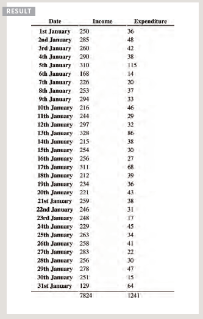

---

## Javascript Functions, Methods, and Objects

Creating many object: Constructor notation

sometimes you will want several several objects to represnt similer things.
object constructor can use a function as atemplate for creating objects.
First, create the template with the object's properties and methods.

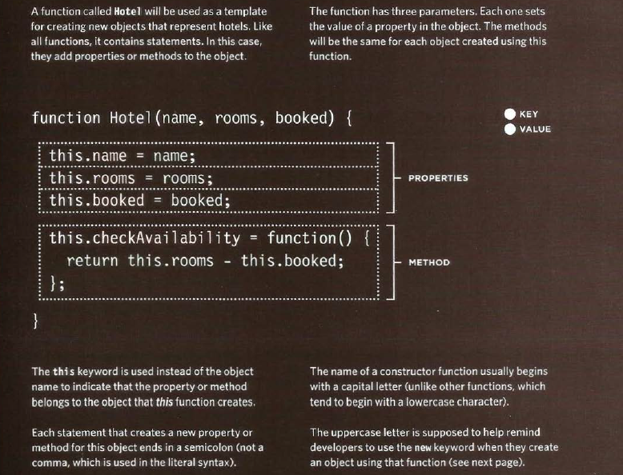


### CREATING OBJECTS USING CONSTRUCTOR SYNTAX

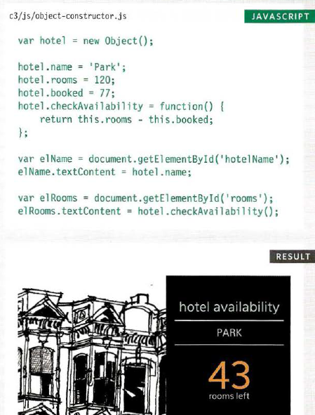

### CREATE & ACCESS OBJECTS CONSTRUCTOR NOTATION

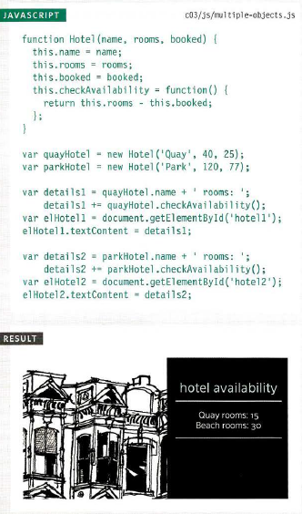

### ADDING AND REMOVING PROPERTIES

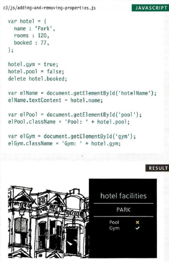


## Array are objects

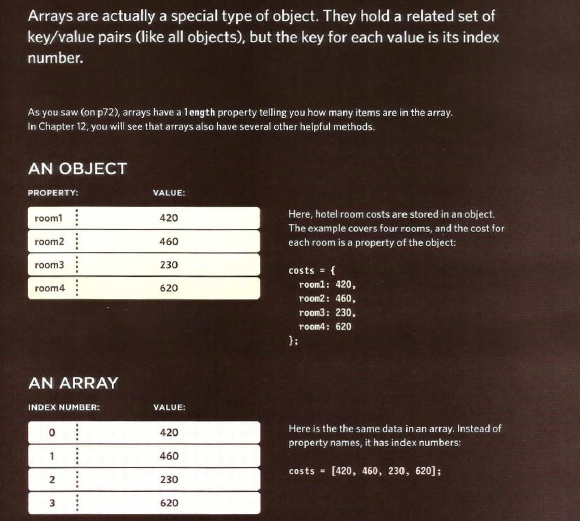

## Arrays of objects and objects of arrays

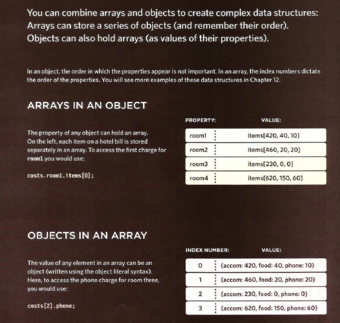


## WHAT ARE BUILT-IN OBJECTS?

Browsers come with a set of built-in objects that represent things like the
browser window and the current web page shown in that window. 
These built-in objects act like a toolkit for creating interactive web pages.

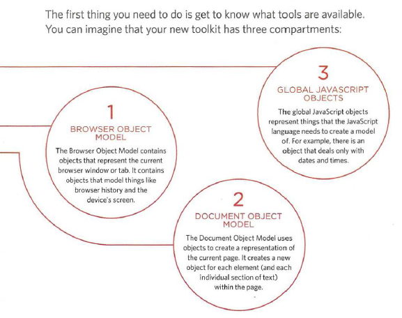

### Three groups of built-in objects

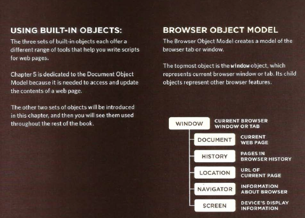

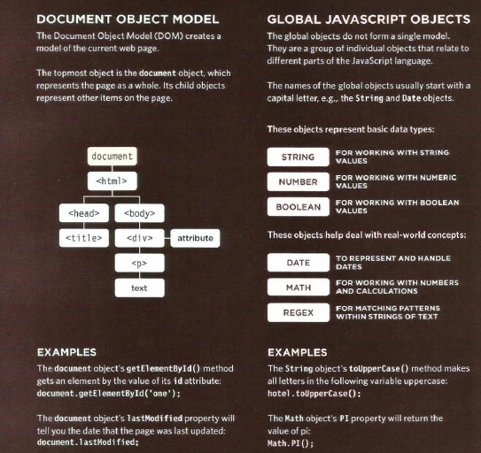


### Creating an instance of the date object

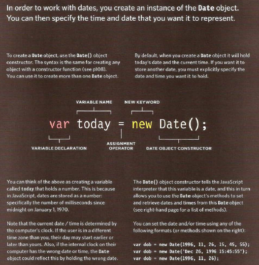

---

* Functions allow you to group a set of related statements together that represent a single task.
* Functions can take parameters (informatiorJ required to do their job) and may return a value.
* An object is a series of variables and functions that represent something from the world around you.
* In an object, variables are known as properties of the object; functions are known as methods of the object.
* Web browsers implement objects that represent both the browser window and the document loaded into the
browser window.
* JavaScript also has several built-in objects such as String, Number, Math, and Date. Their properties and
methods offer functionality that help you write scripts.
* Arrays and objects can be used to create complex data sets (and both can contain the other).