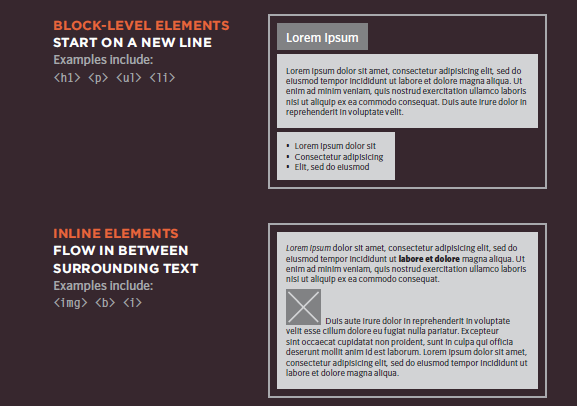
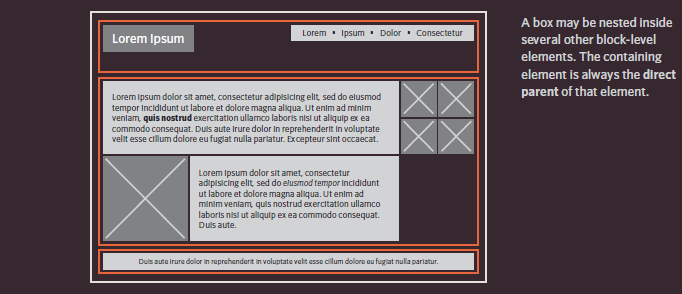
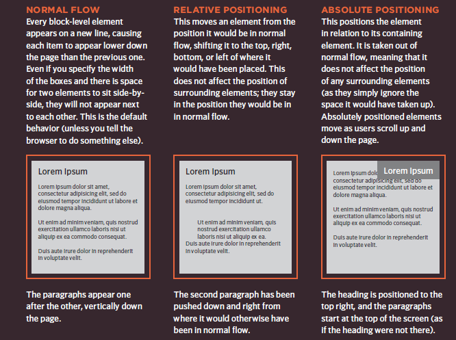
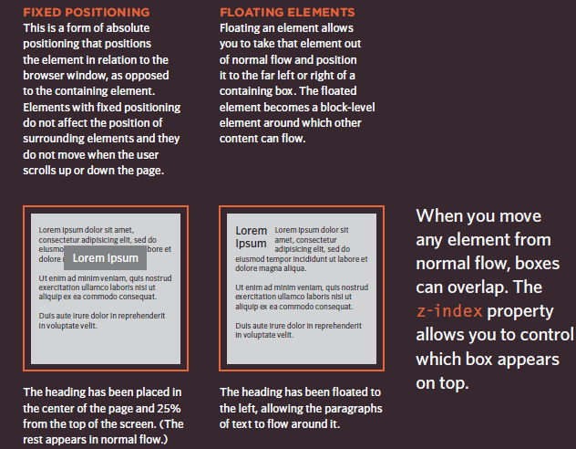

### Layout

how to control where each element sits on a page and how to create attractive page layouts.

This involves learning about how designing for a screen can be different to designing for other mediums (such as print). In this chapter we will:

* Explore different ways to position e ●● lements using normal flow, relative positioning, absolute positioning and floats.

* Discover how various devices have different screen sizes and resolution, and how this affects the design process.
* Learn the difference between fixed width and liquid layouts, and how they are created.
* Find out how designers use grids to make their page designs look more professional.

### Key Concepts in Positioning El ements

**Building Blocks**

CSS treats each HTML element as if it is in its own box. This box will either be a block-level
box or an inline box.

Block-level boxes start on a new line and act as the main building blocks of any layout, while inline boxes flow between surrounding text. You can control how much space each box takes up by setting the width of the
boxes (and sometimes the height, too).
To separate boxes, you can use borders, margins, padding, and background colors.

**Containing Elements**

If one block-level element sits inside another block-level element then the outer box is known as the containing or parent element. It is common to group a number of elements together inside a `
` (or other block-level) element. For example, you might group together all of the elements that form the header of a site (such as the logo and the main navigation). The `
` element that contains this group of
elements is then referred to as the containing element.

The orange lines in this diagram represent `
` elements. The header (containing the logo and navigation) are in one `
` element, the main content of the page is in another, and the footer is in a third. The `<body>` element is the containing element for these three `
` elements. The second `
` element is the containing element for two paragraphs of Latin text and images (represented by crossed squares).

### Controll ing the Position of El ements

CSS has the following positioning schemes that allow you to control the layout of a page: normal flow, relative positioning, and absolute positioning. You specify the positioning scheme using the position
property in CSS. You can also float elements using the float property.

To indicate where a box should be positioned, you may also need to use box offset properties to tell the browser how far from the top or bottom and left or right it should be placed. (You will meet these when we
introduce the positioning schemes on the following pages.)

---