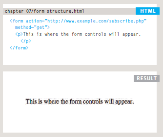

# HTML Forms

Traditionally, the term 'form' has referred to a printed document that contains spaces for you to fill in information. HTML borrows the concept of a form to refer to different elements that allow you to collect information from visitors to your site.

### Why Forms?

The best known form on the web is probably the search box that sits right in the middle of Google's homepage.

In addition to enabling users to search, forms also allow users to perform other functions online. You will see forms when registering as a member of a website, when shopping online, and when signing up for
newsletters or mailing lists.

## Form Controls

There are several types of form controls that you can use to collect information from visitors
to your site.

### How Forms Work

A user fills in a form and then presses a button to submit the information to the server.

A form may have several form controls, eachgathering different information. The server
needs to know which piece of inputted data corresponds with which form element.

### Form Structure

`<form>`
Form controls live inside a `<form>` element. This element should always carry the action
attribute and will usually have a method and id attribute too.

`action`
Every `<form>` element requires an action attribute. Its value is the URL for the page on the
server that will receive the information in the form when it is submitted.

`method`
Forms can be sent using one of two methods: get or post. With the get method, the values from the form are added to the end of the URL specified in the action attribute. The get method is ideal for:
* short forms (such as search boxes)
* when you are just retrieving data from the web server (not sending information that 
should be added to or deleted from a database)

With the post method the values are sent in what are known as HTTP headers. As a rule of thumb you should use the post method if your form:
* allows users to upload a file
* is very long
* contains sensitive data (e.g. passwords)
* adds information to, ordeletes information from, a database If the method attribute is not
used, the form data will be sent using the get method.

`id`
We look at the id attribute on page 183, but the value is used to identify the form distinctly from other elements on the page (and is often used by scripts — such as those that check you have
entered information into fields that require values).

---

# Lists, Tables and Forms

### BULLET POINT STYLES list-style-type

The list-style-type property allows you to control the shape or style of a bullet point (also
known as a marker). It can be used on rules that apply to the <ol>, <ul>, and <li> elements.

**Unordered Lists**
For an unordered list you can use the following values:
* none
* disc
* circle
* square

**Ordered Lists**
For an ordered (numbered) list you can use the following values:

* decimal
* decimal-leading-zero
* lower-alpha
* upper-alpha
* lower-roman
* upper-roman

### TABLE PROPERTIES

**width:** to set the width of the table
**padding:** to set the space between the border of each table cell and its content
**text-transform:** to convert the content of the table headers to uppercase
**letter-spacing, font-size:** to add additional styling to the content of the table headers
**border-top, border-bottom:** to set borders above and below the table headers
**text-align:** to align the writing to the left of some table cells and to the right of the others
**background-color:** to change the background color of the alternating table rows
**:hover** to highlight a table row when a user's mouse goes over it.

---

# JS EVENT

Here is a selection of the events that occur in the browser while you are
browsing the web. Any of these events can be used to trigger a function
in your JavaScript code.

**EVENTS FIRE OR ARE RAISED**
When an event has occurred, it is often described as having fired or been raised. In the diagram on the right, if the user is tapping on a link, a cl ick event would fire in the browser.
**EVENTS TRIGGER SCRIPTS**
Events are said to t rigger a function or script. When the click event fires on the element in this diagram, it could trigger a script that enlarges the selected item.

### HOW EVENTS TRIGGER JAVASCRIPT CODE

When the user interacts with the HTML on a web page, there are three steps involved in getting it to trigger some JavaScript code. Together these steps are known as event handling.

1. Select t he element node(s) you want the script to respond to.
For example, if you want to trigger a function when a user clicks on a specific link, you need
to get the DOM node for that link element. You do this using a DOM query.

2. Indicate which event on the selected node(s) will trigger the response. Programmers call this binding an
event to a DOM node.

3. State the code you want to run when the event occurs. When the event occurs, on a
specified element, it will trigger a function. This may be a named or an anonymous function.

Here you can see how event handling can be used to provide feedback to users filling in a registration form. It will show an error message if their username is too short.

### TRADITIONAL DOM EVENT HANDLERS

All modern browsers understand this way of creating an event handler,
but you can only attach one function to each event handler.

### EVENT LISTENERS
Event listeners are a more recent approach to handling events. They can deal with more than one function at a time but they are not supported in older browsers.

### USING PARAMETERS WITH EVENT HANDLERS & LISTENERS

Because you cannot have parentheses after thefunction names in event handlers or listeners,
passing arguments requires a workaround.

### USING PARAMETERS WITH EVENT LISTENERS

