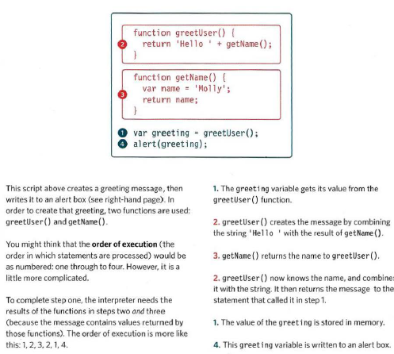
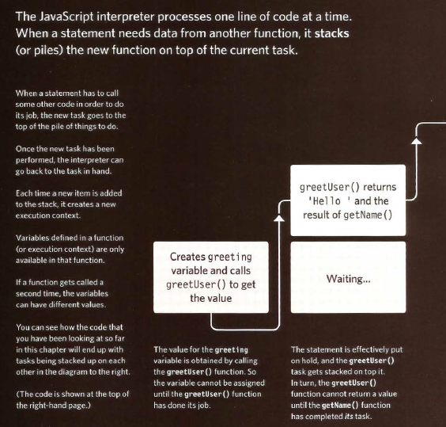
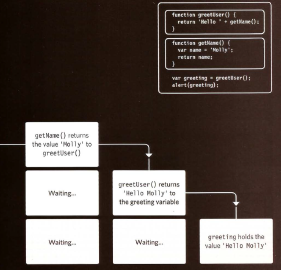
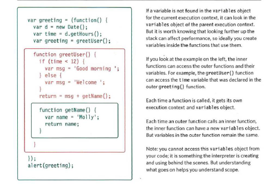
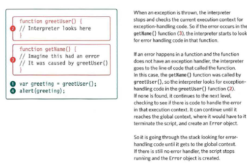
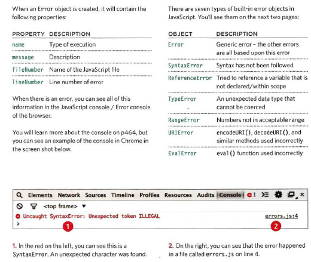
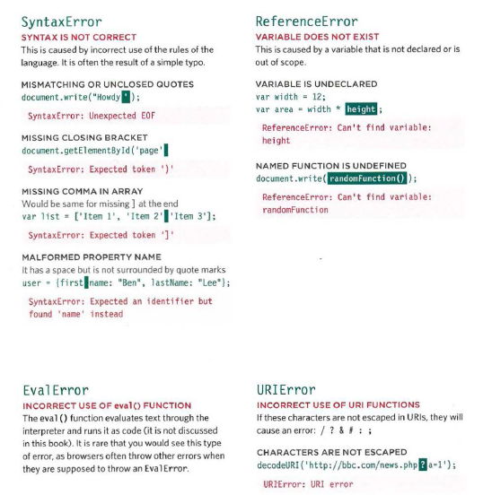
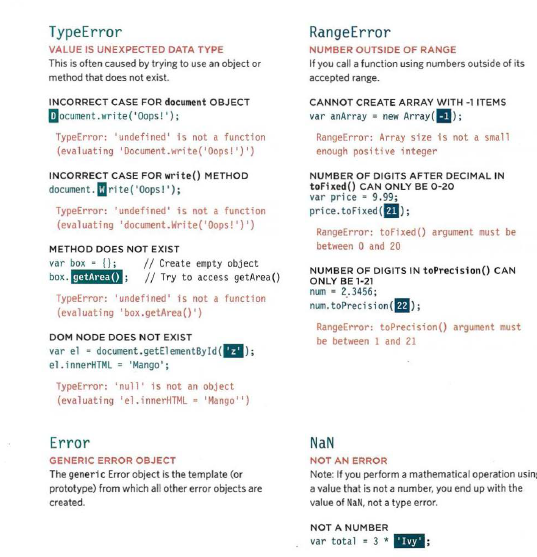
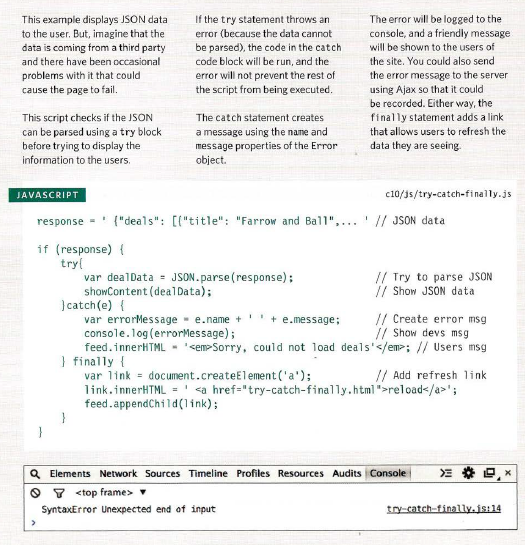
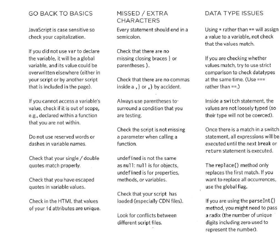

# Error Handling & Debugging

To find the source of an error, it helps to know how scripts are processed. The order in which statements are executed can be complex; some task cannot complete until another statement or function has been run:



### The stack





### UNDERSTANDING SCOPE

In the interpreter, each execution context has its own va ri ables object.
It holds the variables, functions, and parameters available within it.
Each execution context can also access its parent's v a ri ables object.

Functions in JavaScript are said to have lexical scope. They are linked to the object they were defined within.
So, for each execution context, the scope is the current execution context's variables object, plus the
variables object for each parent execution context.

Imagine that each function is a nesting doll. The children can ask the parents for information in
their variables. But the parents cannot get variables from their children. Each child will get the same
answer from the same parent.



### UNDERSTANDING ERRORS

If a JavaScript statement generates an error, then it throws an exception.
At that point, the interpreter stops and looks for exception-handling code.

If you are anticipating that something in your code may cause an error, you can use a set of statements
to handle the error (you meet them on p480). This is important because if the error is not handled,
the script will just stop processing and the user will not know why. So exception-handling code should
inform users when there is a problem.

Whenever the interpreter comes across an error, it will look for error-handling code. In the diagram
below, the code has the same structure as the code you saw in the diagrams at the start of the chapter.
The statement at step 1 uses the function in step 2, which in turn uses the function in step 3. Imagine
that there has been an error at step 3.




### ERROR OBJECTS

Error objects can help you find where your mistakes are and browsers have tools to help you read them.



### ERROR OBJECTS CONTINUED

Please note that these error messages are from the Chrome browser. Other browsers' error messages may vary.



These two pages show JavaScript's seven different types of error objects and some common examples of the kinds of errors you are likely to see. As you can tell, the errors shown by the browsers can be rather cryptic.




### HOW TO DEAL WITH ERRORS

Now that you know what an error is and how the browser treats them, there are two things you can do with the errors.

1. DEBUG THE SCRIPT TO FIX ERRORS
If you come across an error while writing a script (or when someone reports a bug), you will need to
debug the code, track down the source of the error, and fix it. You will find that the developer tools available in every major modern browser will help you with this task. In this chapter, you will learn about the
developer tools in Chrome and Firefox. (The tools in Chrome are identical to those in Opera.)
IE and Safari also have their own tools (but there is not space to cover them all).

2. HANDLE ERRORS GRACEFULLY
You can handle errors gracefully using try, catch, throw, and f i na 1 ly statements. Sometimes, an error may occur in the script for a reason beyond your control. For example, you might request data from a third party, and their server may not respond. In such cases, it is particularly important to write error-handling code.
In the latter part of the chapter, you will learn how to gracefully check whether something will work, and
offer an alternative option if it fails.


### A DEBUGGING WORKFLOW

Debugging is about deduction: eliminating potential causes of an error. Here is a workflow for techniques you will meet over the next 20 pages. Try to narrow down where the problem might be, then look for clues.

**WHERE IS THE PROBLEM?**
First, should try to can narrow down the area where the problem seems to be. In a long script, this is
especially important.
1. Look at the error message, it tells you:

* The relevant script that caused the problem.
* The line number where it became a problem for the interpreter. (As you will see, the cause of
the error may be earlier in a script; but this is the point at which the script could not continue.)
* The type of error (although the underlying cause of the error may be different).

2. Check how far the script is running. Use tools to write messages to the console to tell
how far your script has executed.

3. Use breakpoints where things are going wrong. They let you pause execution and inspect the va lues
that are stored in variables.

**WHAT EXACTLY IS THE PROBLEM?**
Once you think that you might know the rough area in which your problem is located, you can then try to
find the actual line of code that is causing the error.

1. When you have set breakpoints, you can see if the variables around them have the values you would expect them to. If not, look earlier in the script.
2. Break down I break out parts of the code to test smaller pieces of the functionality.

* Write values of variables into the console.
* Calrfunctions from the console to check if they are returning what you would expect them to.
* Check if objects exist and have the methods I properties that you think they do.

3. Check the number of parameters for a function, or the number of items in an array. And be prepared to repeat the whole process if the above solved one error just to uncover another ...


### HANDLING EXCEPTIONS

If you know your code might fail, use try, catch, and finally. Each one is given its own code block.

```

try {
II Try to execute this code
catch (exception) {
II If there is an exception, run this code
finally {
    II This always gets executed
}

```




### COMMON ERRORS
Here is a list of common errors you might find with your scripts.


