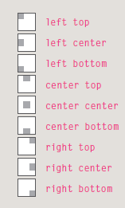
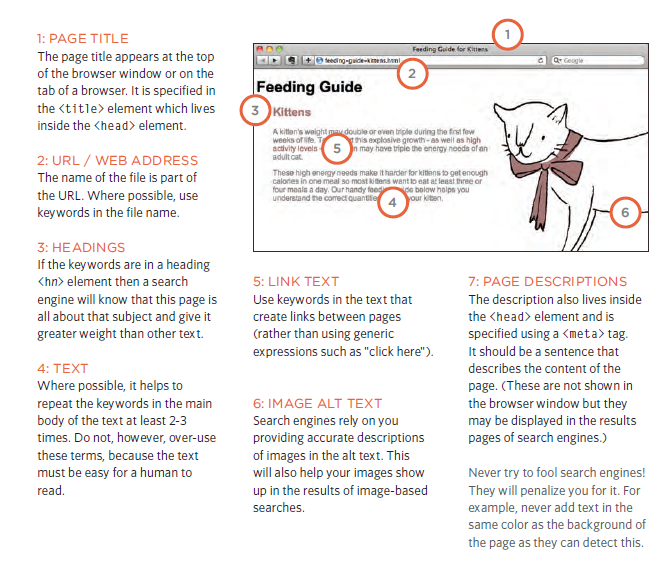

# HTML Images

### Controlling sizes of images in CSS

You can control the size of an image using the width and height properties in CSS, just like you can for any other box. Specifying image sizes helps pages to load more smoothly because the HTML and CSS code will often load before the images, and telling the browser how much space to leave for an image allows it to render the rest of the page without waiting for the image to download.

### AligNi ng images using CSS

web page authors are increasingly using the float property to align images. There are two ways that
this is commonly achieved:

1. The float property is added to the class that was created to represent the size of the image
(such as the small class in our example).
2. New classes are created with names such as align-left or align-right to align the images to the left or right of the page. These class names are used in addition to classes that indicate the size of the image.

### Centering images Using CSS

By default, images are inline elements. This means that they flow within the surrounding text. In order to center an image, it should be turned into a blocklevel element using the display property with a value of block. Once it has been made into a block-level element, there are two common ways in which you
can horizontally center an image:

1. On the containing element, you can use the text-align property with a value of center. 

2. On the image itself, you can use the use the margin property and set the values of the left and
right margins to auto.

You can specify class names that allow any element to be centered, in the same way that
you can for the dimensions or alignment of images.

### Background Images background-image

The background-image property allows you to place an image behind any HTML element. This could be the entire
page or just part of the page. By default, a background image will repeat to fill the entire box.
The path to the image follows the letters url, and it is put inside parentheses and quotes.

### Background Position background-position

When an image is not being repeated, you can use the background-position property to specify where in the
browser window the background image should be placed. This property usually has a pair of values. The first represents the horizontal position and the second represents the vertical.

---

# HTML Practical Information

### Search Engine Optimization (SEO)

**The Basics**

Search engine optimization (or SEO) is the practice of trying to help your site appear nearer the top of search engine results when people look for the topics that your website covers. At the heart of SEO is the idea of working out which terms people are likely to enter into a search engine to find your site and then
using these terms in the right places on your site to increase the chances that search engines will show a link to your site in their results. In order to determine who comes first in the search results, search engines do not only look at what appears on your site. They also consider how many sites link to you (and how relevant those links are). For this reason, SEO is often split into two areas: on-page techniques and off-page
techniques.

**On-Page Techniques**

On-page techniques are the methods you can use on your web pages to improve their rating in search engines.
The main component of this is looking at keywords that people are likely to enter into a search engine if they wanted to find your site, and then including these in the text and HTML code for your site in order to help the
search engines know that your site covers these topics. Search engines rely very heavily on the text that is in your pages so it is important that the terms people are going to search for are in text. There are seven
essential places where you want your keywords to appear. Ensuring that any images have appropriate text in the value of their alt attribute also helps search engines understand the content of images.

**Off-Page Techniques**

Getting other sites to link to you is just as important as on-page techniques. Search engines help determine how to rank your site by looking at the number of other sites that link to yours. They are particularly interested in sites whose content is related to yours. For example, if you were running a website that sold fish bait, then a link from a hairdresser is not likely to be considered as relevant as one from an angling community. Search engines also look at the words between the opening `<a>`tag and closing `</a>`tag in the link. If the text in the link contains keywords (rather than just click here or your website address) it may be considered more relevant. The words that appear in links to your site should also appear in the text of the page that the site links to.

### On-Page SEO

